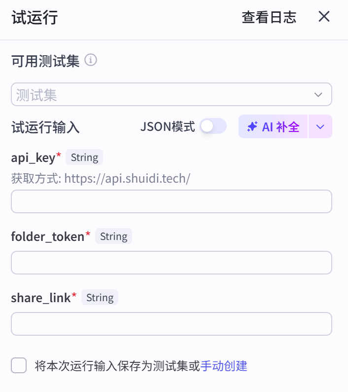
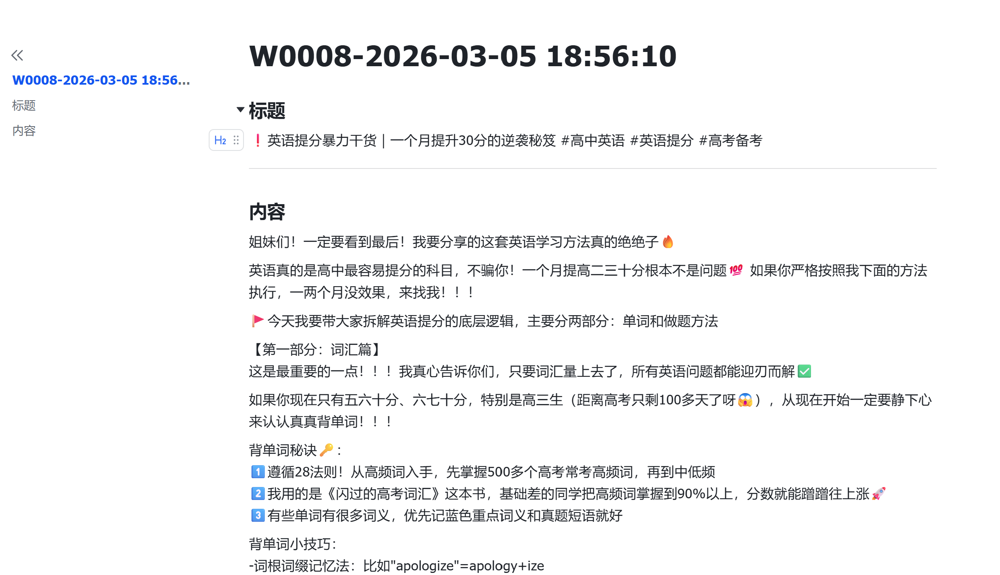

# X7_W_red_word_1 — 小红书视频笔记仿写润色工作流

提取小红书视频/笔记内容，进行仿写与润色，并保存到飞书文档。

## 效果展示

### 1. 试运行输入

在「开始」节点中填写 api_key、folder_token、小红书分享链接等参数后即可试运行。



### 2. 原始视频截图

待处理的小红书视频/笔记页面示意。


### 3. 生成文档截图

工作流执行完成后，在飞书中生成的仿写/润色文档效果。



## 项目说明

本仓库为**工作流（Workflow）**项目，实现从「小红书分享链接」到「飞书文档」的自动化内容处理流水线：解析视频、提取文案、校对、仿写为小红书风格、写入飞书并返回文档链接。

## 目录结构

```
Workflow-X7_W_red_word_1-draft-5296/
├── MANIFEST.yml          # 工作流元信息（类型、版本、名称、描述等）
├── workflow/
│   └── X7_W_red_word_1-draft.yaml   # 工作流定义（节点、连线、参数）
├── images/               # 效果展示截图（见下方）
│   ├── trial-run-input.png    # 试运行输入
│   ├── original-video.png     # 原始视频截图
│   └── generated-doc.png     # 生成文档截图
└── README.md             # 本说明文件
```

## 使用前准备

运行工作流前需准备以下输入（在「开始」节点中填写）：

| 参数 | 类型 | 必填 | 说明 |
|------|------|------|------|
| `api_key` | string | 是 | API 密钥，获取方式：https://api.shuidi.tech/ |
| `folder_token` | string | 是 | 飞书文档要存放的文件夹 Token（或文件夹 URL） |
| `share_link` | string | 是 | 小红书视频/笔记的分享链接 |

## 工作流步骤概览

1. **开始**  
   接收上述三个参数，作为整条流水线的输入。

2. **parse_video（视频解析）**  
   根据 `share_link` 解析小红书视频/笔记，得到封面、标题、视频地址等；输出状态码 `code`（0 表示成功）。

3. **选择器（条件分支）**  
   - 若 `code ≠ 0`：进入「视频解析失败或该链接无视频」分支，**抛出错误**并结束。
   - 若 `code = 0`：继续后续步骤。

4. **voice_to_text（视频文案提取）**  
   使用「视频文案提取」插件，将视频/语音转成文字，作为后续仿写与润色的原文。

5. **content_check（文案校对）**  
   对提取出的文案做校对，提升文本质量。

6. **文本处理 + llm（仿写与润色）**  
   - 用预设的「小红书风格短视频内容创作专家」提示词（含角色、背景、任务、输出格式、写作原则等）与原文拼接。
   - 调用大模型（如 wujie）生成小红书风格的标题与正文，输出为指定 JSON 格式（含 `title`、`content`）。

7. **代码节点**  
   解析大模型返回的 JSON，得到结构化标题和正文，供创建飞书文档使用。

8. **文件名称 / 日期时间**  
   确定最终文档标题（可与日期时间等组合）。

9. **create_document（飞书云文档）**  
   在指定 `folder_token` 下创建飞书文档，标题和正文来自上一步；支持 Markdown。

10. **结束**  
    返回新建飞书文档的链接等信息，便于直接打开查看结果。

## 输出说明

- 成功时：工作流输出为**新创建的飞书文档链接**，打开即可查看仿写、润色后的内容。
- 失败时：若视频解析失败或链接无视频，会抛出错误提示：「视频解析失败或该链接无视频」。

## 技术信息

- **工作流类型**：Workflow  
- **Schema 版本**：1.0.0  
- **主流程 ID**：7613323463902281766  
- **依赖能力**：视频解析、视频文案提取、文案校对、大模型调用、飞书云文档创建、日期时间等（具体以所用平台插件为准）。

## 使用与导入

- 本工作流以 YAML 定义，需在支持该 Workflow 格式的平台（如支持水滴/Coze 工作流等）中**导入** `workflow/X7_W_red_word_1-draft.yaml` 或整个项目后运行。
- 运行前请在「开始」节点中正确配置 `api_key`、`folder_token`、`share_link`，并确保账号具备飞书文档创建权限及对应 API 权限。

---

如有问题或需要调整节点、提示词，可直接在对应平台的工作流编辑器中修改 `workflow/X7_W_red_word_1-draft.yaml` 或界面中的节点配置。
